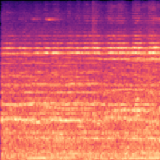
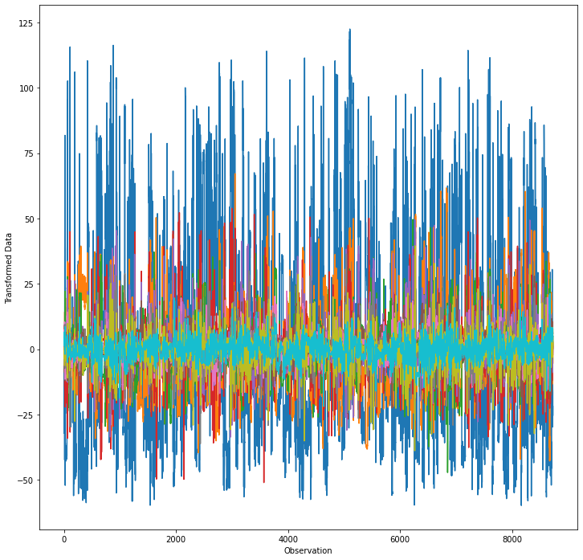

# <span style="color:#E63B2E">Phonetix</span>
## Danger Reported by Machine Learning
###### This Project was made possible using the [UrbanSound8K Dataset](https://www.kaggle.com/chrisfilo/urbansound8k) available on [Kaggle.com](https://www.kaggle.com)

---


# [Phonetix Demo Video](https://res.cloudinary.com/lgxy/video/upload/v1628610866/phonetix.mov)

### [Slideshow Presentation](https://docs.google.com/presentation/d/1Cg5-jVbWpvLKC905xI4rTFVctSkZRl9b4V15AI0h-TQ/edit?usp=sharing)

---

#### This project was created using Python, JavaScript, and PostgreSQL. Hosted through AWS in an EC2 instance.
The backend uses [Flask](https://flask.palletsprojects.com/en/2.0.x/), the Mobile app is made on [React Native](https://reactnative.dev/) and [Expo](https://expo.dev/). The Front end was programmed using [React.js](https://reactjs.org/).

---

### __Table of Contents__

1. __Exploratory Data Analysis__
  * An Overview of the Data (Clean vs Live)


2. __Machine Learning__
  * Convolutional Neural Network


3. __Implementation__
  * Mobile App & Live Audio Feed


4. __Future Work__
  * So What? How to Improve?

---

*“The city's current three-year ShotSpotter contract is worth $33 million.”* __-ABC7 Chicago__

---

### __Exploratory Data Analysis__
#### An Overview of the Data (Clean vs Live)

This dataset consists of the UrbanSound8K dataset plus ~500 .wav files classified as "other" to let our model predict "Noise" when the sound picked up matches none of the other classified sounds.

In order to be able to work with the audio data, all  the *.wav* files were converted to [Mel Spectrograms](https://towardsdatascience.com/getting-to-know-the-mel-spectrogram-31bca3e2d9d0), find out more about their meaning and importance through this article. In summary, Mel Spectrograms hold features of audio that are not available to humans due to the way we process sound. Using some fancy math algorithms the sound is converted to image mel spectrograms. Audio  can be hard to work with but converting it to an image extracts important features and facilitates the process of classification

Live data was extracted through the app implementation by saving all recorded .wav files into the backend/temp folder and from there were classified according to what they were.

##### Classifications?

```diff
+ Air Conditioner
- Car Horn
+ Children Playing
- Dog Bark
- Drilling
+ Engine Idling
- Gun Shot
- Jackhammer
- Siren
+ Street Music
+ Noise


- Danger
+ Not Danger
```

##### Sample Mel Spectrogram of a Gun Shot



*Note: The X-axis represents Time*

##### Principal Component Analysis
Principal component analysis is a matrix dimension reduction technique that keeps 95% of the variance in the matrix but reduces in size to perform operations faster and more efficiently.



*Note: Each color represents a different component (a different class)*

---

### __Machine Learning__
#### Convolutional Neural Network

* 1,401,979 Params
* 3 Conv Blocks
  * Max Pool
  * 2 Conv
* Flatten
* Dense (11 Outputs)


| __Image Resizing__ | __Batch Size__     | __Callbacks__                |
|--------------------|--------------------|------------------------------|
| 200 x 200          | 32                 | LR on Plateau Early Stopping |
| __Metric__         | __Classification__ | __Validation Accuracy__      |
| Accuracy           | Softmax            | 88.1 %                       |

------

### __Implementation__
#### Mobile App & Live Audio Feed

The model was deployed on the server and live audio is converted to Base64 encoded strings and sent to the server for classification and prediction. The app uses sessions, through username and phone number, to "authenticate" users. Users can then add their "emergency contacts" through the app, which are stored in a PostgreSQL database. Upon detecting danger, the model sends out real-time notifications to the endangered user's emergency contacts, these notifications are either sent as in-app notifications to registered "emergency contacts" or through SMS using [Twilio's SMS API](https://www.twilio.com/).

The landing page for the flask app is available through [this link](https://d1kx3aye6l7gaf.cloudfront.net/
)


The app is only available through Expo Go at this point for a demo video [click here](https://res.cloudinary.com/lgxy/video/upload/v1628610866/phonetix.mov)


------

### __Future Work__
#### So What? How to Improve?

In the end, the _"so what?"_ __save money & increase safety__ around the city. This project simply serves as an example of what is doable in the "bare minimum" scenario and what can be achieved in the future. Perhaps the installation of systems such as these in Ring cameras powered by Amazon or devices around the city that can help increase security and decrease expenditures citywide.

**Other ways to train models**

An idea that occurred to me, is training on "danger" vs "not danger" and then classifying according to that to increase the recall (false positive effect). Adding more sounds to what is considered danger as well as noise reduction on the sound thats coming in to be able to capture the good features of sound.

### Thank you

#### [dannyyy.jimenez@gmail.com](mailto:dannyyy.jimenez@gmail.com)
#### [dannyyy-jimenez on GitHub](https://github.com/dannyyy-jimenez)
#### [Connect with me on LinkedIn](https://www.linkedin.com/in/dannyyy/)
